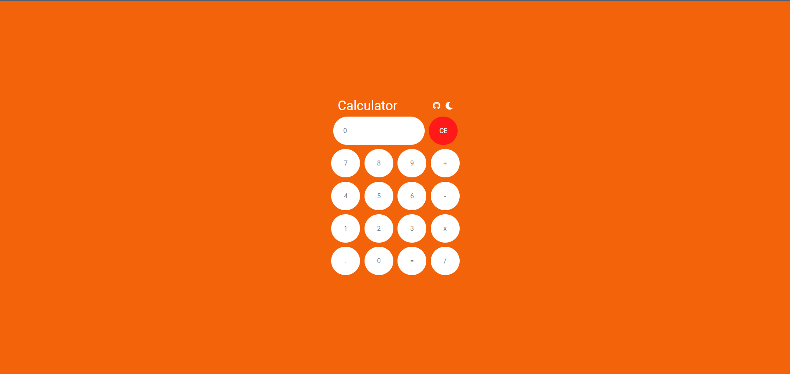
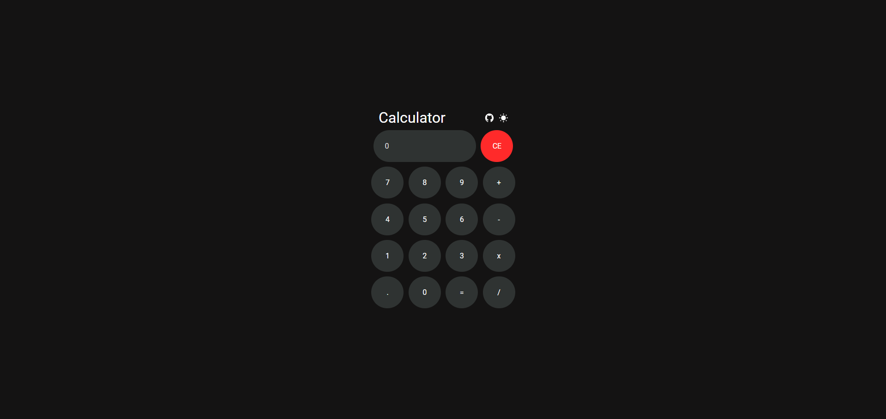

# JavaScript Calculator with Dark Mode 🌗

A simple yet elegant calculator built with HTML, CSS, and JavaScript, featuring smooth transitions between light and dark themes. This project serves as a demonstration of basic web development skills, focusing on user experience and interface design.

## Table of Contents
- [Features](#features)
- [Screenshots](#screenshots)
- [Installation](#installation)
- [Usage](#usage)
- [Customization](#customization)
- [Contributing](#contributing)
- [License](#license)

## Features

- **Light and Dark Mode:** Switch seamlessly between light and dark themes with a smooth transition effect.
- **Responsive Design:** The calculator layout adapts to different screen sizes, making it usable on various devices.
- **Keyboard Support:** Perform calculations using your keyboard for a faster and more intuitive experience.
- **Clear and Concise UI:** A clean and minimalistic design, providing a straightforward user experience.

## Screenshots

### Light Mode


### Dark Mode



## Installation

1. Clone the repository to your local machine:

    ```bash
    git clone https://github.com/PARTH-kodes/OlBSlP.git
    ```

2. Open the `index.html` file in your preferred browser

    ```bash
    open index.html
    ```

## Usage

- *Switch Themes:* Click the theme button on the top right to toggle between light and dark modes.
- *Perform Calculations:* Use the on-screen buttons or your keyboard to enter numbers and operations. Press `Enter` to evaluate the expression.
- *Clear Input:* Press the `C` button or `Backspace` to clear the current input.

## Customization

You can easily customize this project to fit your needs:

- Change the Theme Colors:
    - Modify the colors in the `light.css` and `dark.css` files to match your preferred aesthetics.

- Update the Font:
    - To change the font, update the `font-family` in the CSS files. You can use Google Fonts or a local font file.

- Modify Button Layout:
    - The layout of the calculator buttons can be adjusted in the `index.html` file. You can reorganize them according to your preference.
