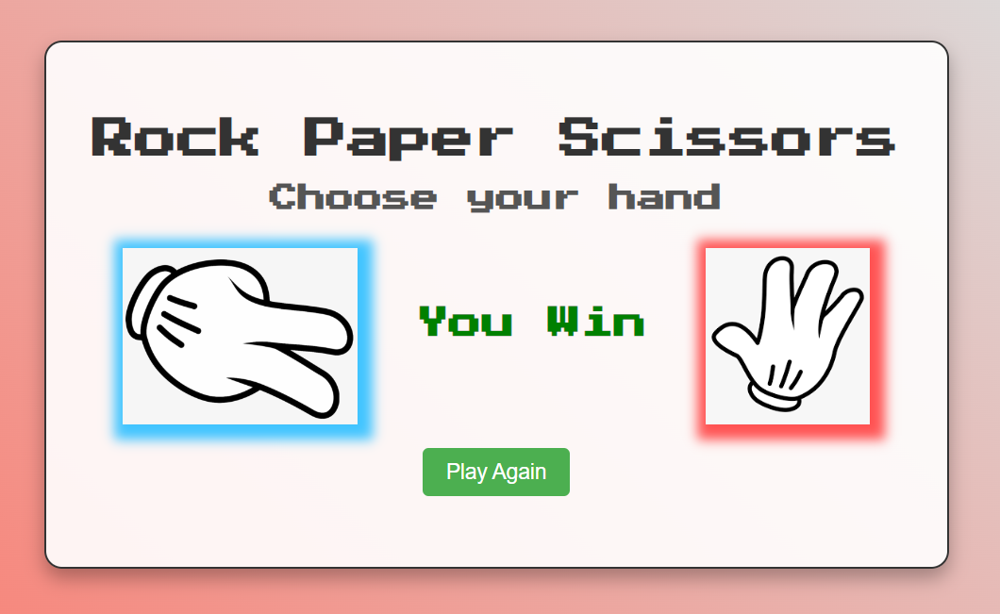

# Rock Paper Scissors Game


Welcome to the Rock Paper Scissors Game! This is a fun and interactive web-based game where you can play the classic game of Rock Paper Scissors against the computer. The game is built using HTML, CSS, and JavaScript.

## Table of Contents

- [Features](#features)
- [Screenshots](#Screenshotss)
- [Installation](#installation)
- [Usage](#usage)
- [Project Structure](#project-structure)
- [Contributing](#contributing)
- [License](#license)
- [Acknowledgements](#acknowledgements)

## Features

- Simple and intuitive user interface
- Responsive design for all screen sizes
- Real-time game play against the computer
- Play Again functionality to restart the game
- Attractive visuals and animations

## Screenshots

### Game Interface


### Win Scenario



### Loss Scenario


### Draw Scenario


## Installation

1. Clone the repository:

   ```bash
   git clone https://github.com/yourusername/rock-paper-scissors.git
   ```

2. Navigate to the project directory:

   ```bash
   cd rock-paper-scissors
   ```

3. Open the `rock_paper_scissors.html` file in your web browser:

   ```bash
   open rock_paper_scissors.html
   ```

## Usage

1. Open the game in your preferred web browser.
2. Click on one of the hand images (Rock, Paper, or Scissors) to make your choice.
3. The computer will randomly select its hand, and the result will be displayed.
4. Click the "Play Again" button to start a new game.

## Project Structure

rock-paper-scissors/<br>
├── rock_paper_scissors.html # HTML file for the game interface<br>
├── style.css # CSS file for styling the game<br>
├── script.js # JavaScript file for game logic<br>
├── rock.png # Image file for Rock hand<br>
├── paper.png # Image file for Paper hand<br>
├── scissor.png # Image file for Scissor hand<br>
├── Screenshots/ # Directory for screenshots<br>
│ ├── game.png # Screenshot of the game interface<br>
│ ├── win.png # Screenshot of the win scenario<br>
│ ├── loss.png # Screenshot of the loss scenario<br>
│ ├── draw.png # Screenshot of the draw scenario<br>
└── README.md # This file<br>

## Contributing

Contributions are welcome! If you have any suggestions or improvements, please open an issue or submit a pull request.

1. Fork the repository
2. Create a new branch (`git checkout -b feature-branch`)
3. Make your changes
4. Commit your changes (`git commit -m 'Add some feature'`)
5. Push to the branch (`git push origin feature-branch`)
6. Open a pull request

## Acknowledgements

- [Press Start 2P](https://fonts.google.com/specimen/Press+Start+2P) font from Google Fonts
- Background gradient inspired by [uigradients](https://uigradients.com/)
- Icons made by [Freepik](https://www.flaticon.com/authors/freepik) from [Flaticon](https://www.flaticon.com/)

Enjoy the game!
